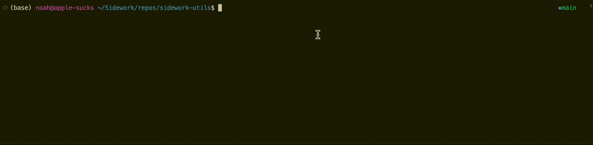
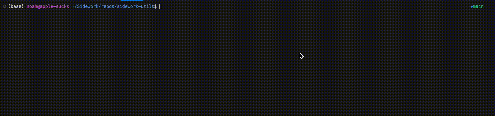
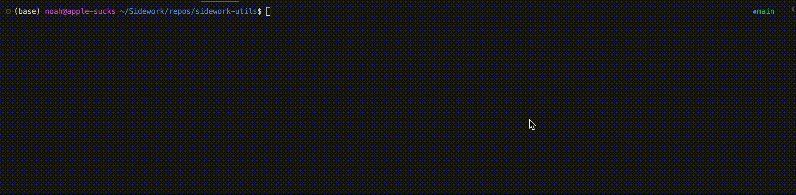
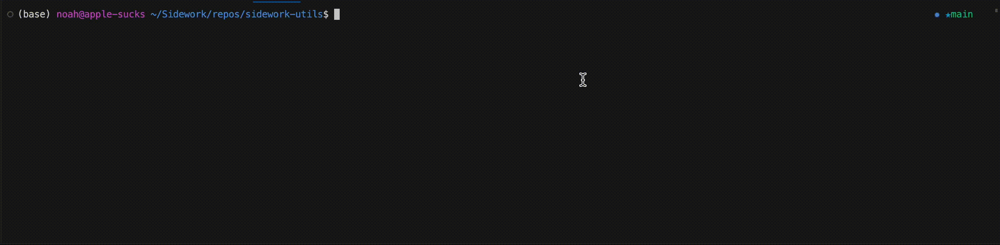
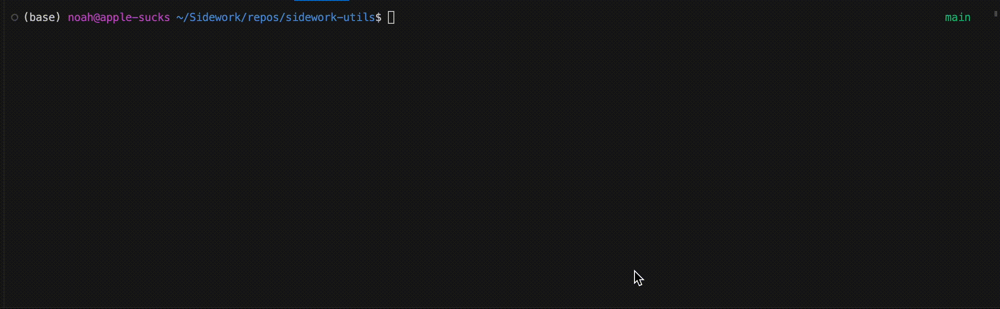

# sidework-utils
```
CLI tool to provide various utility functions to Sidework engineers, such as batch firmware updates, 
quick machine status checks, rapid log grabbing and temperature grabbing, etc

this tool is intended to be perpetually expanded, architected in such a way that new features 
can be productively added by anyone as needs arise
```
&nbsp;


## installation

clone the repo and then run the provided installer, ensure ur using python 3 (installer will tell you if ur not)

```
  git clone git@bitbucket.org:backbar/sidework-utils.git
  cd sidework-utils
  python install.py
```
you will also need an api key and an authentication token, which you can request from a sidework admin 

place these into seperate files named as you please, but blank placeholders are provided in this repo for convenience

```
echo PASTE_UR_API_KEY_HERE >> api-key-blank
echo PASTE_UR_AUTH_TOKEN_HERE >> token-blank
cp api-key-blank api-key && cp token-blank token
```
you can name yours wahtever u like, but make sure not to push your credentials to this repo if you contribute

file names 'token' and 'api-key' are already added to *.gitignore for convenience
&nbsp;

## features

thus far the feature list is useful but primitive, please share all new feature requests with noah and he will ensure to pop em in the queue

* list all machines with id and serial numbers
* list latest firmware applications with notes and s3 urls
* print status of any machine
* download logs from any machine
* graph temperature data from any machine
* update firmware on machines (bulk updating supported)
* generate report of firmware update operations
* clear pending firmware updates for any machine
&nbsp;

## support

if you experience bugs reach out to noah and he will investigate as promptly as possible 

if you experience an absence of feature that is effectively a bug that counts too
```

```
&nbsp;

# usage
&nbsp;

**help**

run this if ur ever unsure of what the options are
```
python sidework-utils.py -h
```
```
usage: sidework-utils [-h] -k KEY -t TOKEN [--list-latest-apps] [--target TARGET] [--machine-status ID] [--list-all-machines] [--gregorys]
                      [--backbar] [--name-filter FILTER] [--list-logs ID/GC] [--graph-temps ID] [--update-fw] [--notes-filter NOTES] [--clear]

Interactive tools for working with Sidework machines

optional arguments:
  -h, --help               show this help message and exit
  -k KEY, --key KEY        api key stored in a file
  -t TOKEN, --token TOKEN  auth token stored in a file
  --list-latest-apps       prints most recent deployed firmware applications, sorted by target
  --target TARGET          ^^ list only recent apps for provided target (qr_reader, pump, etc)
  --machine-status ID      view previous, current and queued applications for specified machine ID
  --list-all-machines      prints list of all valid machine names with ID and serial numbers
  --gregorys               ^^ pass this flag to only list all gregorys org machines
  --backbar                ^^ pass this flag to only list backbar org machines
  --name-filter FILTER     ^^ pass this flag to filter listed machines by checking names
  --list-logs ID/GC        returns URLs to logs of machine specified by ID number
  --graph-temps ID         graph recent temperature data for machine specified by ID number
  --update-fw              select machine(s) for updating and fw per target
  --notes-filter NOTES     filter fw apps by notes (pass PROD to filter by production releases)
  --clear                  select machine(s) with pending fw updates to cancel

~ with great power comes great responsibility ~
```  
&nbsp;

**authentication**

every other command is prefixed with the following, assuming u placed ur api key and auth token in files described above (adjust accordingly to whatever you named em)

*i am working on a more elegant install script to put this tool in your local path and throw credentials in a global python environment, but that is finicky so this is what weve got*
```
python sidework-utils.py -k api-key -t token
```  
&nbsp;

**list latest firmware applications**

prints a list of applications and their target, firmware version, notes, and s3 url

```
python sidework-utils.py -k api-key -t token --list-latest-apps 
```  
&nbsp;

**get status of any machine**

prints current, previous, scheduled applications and install status per target of specified machine

if u know the machine id skip this step, if not u can find the machine id with the following
```
python sidework-utils.py -k api-key -t token --list-all-machines
```
once you have the machine id, run this
```
python sidework-utils.py -k api-key -t token --machine-status ID
```  
&nbsp;

**list all machines**
 
prints a list of all machines with their common name, ID and serial number
```
python sidework-utils.py -k api-key -t token --list-all-machines
```  
&nbsp;

**downloading logs from any machine**

presents a multi-select menu of recent firmware, machine app and temperature logs for specified machine that are saved locally when u press enter
```
python sidework-utils.py -k api-key -t token --list-logs ID
```  
&nbsp;

**graphing temperature data**

if u know the machine id skip this step, if not u can find the machine id with the following
```
python sidework-utils.py -k api-key -t token --list-all-machines
```
once you have the machine id, run this

```
python sidework-utils.py -k api-key -t token --graph-temps MACHINE_ID
```
make sure your log file is not atrociously large, the plotter cant handle that rn but more elegant large file handling is in the works so for now you should clear existing logs on machines which may have lengthy files before running tests then graphing
&nbsp;

**update firmware on machine(s)**

presents a multi-select menu of machines followed by single-slect menus of firmware applications for each possible board target

intermediate confirmation screens are flashed after every selection, a final confirmation screen is flashed once all options are selected, a log file is generated which includes all selected options, upload results, and a timestamp for the operation

you can select 'none' for any target's application if you don't want to update an entire machine, and selected pdates are only pushed after final confirmation so you can quit at any point if you accidentally selected an incorrect option, changed ur mind, etc

if you fully commit an update and then want to clear the pending updates, you can run the command again with the '--clear' flag and reselect machines to clear the updates and keep machine on its current firmare application versions

```
python sidework-utils.py -k api-key -t token --update-fw
```

*ice conveyor and conveyor targets are not supported*  
&nbsp;


**additional utility options**

several of the above commands involve printing lists or presenting a menu of options, but u may not want to sift through an arbitrary list of all machines, or scroll a menu of all logs, etc

the following options can be provided to the described commands to filter this kind of data  
&nbsp;


```
--target TARGET

TARGET = board name (main, qr_reader, pump, etc)

relevant commands:
 --list-latest-apps (only list apps for target)
```

```
--gregorys

relevant commands:
 --list-all-machines (only shows gregorys org machines)
 --update-fw         (only shows gregorys org machine in options menu)
```

```
--backbar

relevant commands:
 --list-all-machines (only shows backbar org machines)
 --update-fw         (only shows backbar org machine in options menu)
```

```
--name-filter FILTER

FILTER = string or substring of text to check in machine names (Demo, Self, GC)

relevant commands:
 --list-all-machines (only shows machines that contain FILTER in their name)
 --update-fw         (only shows machines than contain FILTER in their name in options menu)
```

```
--notes-filter NOTES

NOTES = notes attached to deployed application (release-83-beta-v2, release-62-pump-hotfix)

relevant commands:
 --update-fw  (only shows applications that have specified notes)
```

```
--clear

relevant commands:
 --update-fw  (select machine(s), then bulk cancel all pending application updates)
```
&nbsp;

# examples
&nbsp;

**print recent applications deployed for main board**

```
python sidework-utils.py -k api-key -t token --list-latest-apps --target main
```
```
Retrieving list of most recently deployed applications...

Target: Main || Version: 2.3.1 || Notes: release-25-final
   URL: https://s3.us-east-2.amazonaws.com/backbar.applications.prod/main/main-2_3_1-release-25-final.bin


Target: Main || Version: 2.3.1 || Notes: release-25-all-issues-resolved-forreal-no-cap
   URL: https://s3.us-east-2.amazonaws.com/backbar.applications.prod/main/main-2_3_1-release-25-all-issues-resolved-forreal-no-cap.bin


Target: Main || Version: 2.3.1 || Notes: release-25-jostle-before-refreshing
   URL: https://s3.us-east-2.amazonaws.com/backbar.applications.prod/main/main-2_3_1-release-25-jostle-before-refreshing.bin

   ...
```
&nbsp;

**graph previous day temperature from a gregorys machine**
```
python sidework-utils.py -k api-key -t token --graph-temps 90  
```

&nbsp;

**download four log files from a machine**
```
python sidework-utils.py -k api-key -t token --list-logs 80  
```

&nbsp;

**get machine ID for GC55 Treasure Coast**
```
python sidework-utils.py -k api-key -t token --list-all-machines --name-filter Treasure
```

&nbsp;

**save all backbar 'Demo' machines to local file for later reference**
```
python sidework-utils.py -k api-key -t token --list-all-machines --name-filter Demo > backbar-demo-ids.txt
```

&nbsp;

**look at all the latest pump board firmware applications**
```
python sidwork-utils.py -k api-key -t token --list-latest-apps --target pump
```

&nbsp;

**check status of a machine**
```
python sidework-utils.py -k api-key -t token --machine-status 9 
```

&nbsp;

**batch update four backbar machines with production release and read report**
```
python sidework-utils.py -k api-key -t token --update-fw --backbar --notes-filter PROD
```

&nbsp;

**batch clear updates for four backbar machines**
```
python sidework-utils.py -k api-key -t token --update-fw --backbar --clear
```
